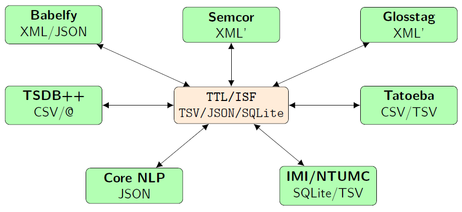

texttaglib module
=================

TTL (abbreviated from ``texttaglib``) is a Python implementation of the corpus linguistic method
described in :ref:`Tuan Anh (2019) <ta_2019>`.
TTL was designed to be a robust linguistic documentation framework which is flexible enough
to handle linguistic data from different sources
(Core NLP, ELAN, CoNLL, Semcor, Babelfy, Glosstag Wordnet, Tatoeba project, TSDB++, to name a few).

TTL can be used as a data interchange format for converting to and from different data formats.

Text corpus
-----------

   >>> from speach import ttl
   >>> doc = ttl.Document('mydoc')
   >>> sent = doc.new_sent("I am a sentence.")
   >>> sent
   #1: I am a sentence.
   >>> sent.ID
   1
   >>> sent.text
   'I am a sentence.'
   >>> sent.import_tokens(["I", "am", "a", "sentence", "."])
   >>> >>> sent.tokens
   [`I`<0:1>, `am`<2:4>, `a`<5:6>, `sentence`<7:15>, `.`<15:16>]
   >>> doc.write_ttl()

The script above will generate this corpus

::

   -rw-rw-r--.  1 tuananh tuananh       0  3月 29 13:10 mydoc_concepts.txt
   -rw-rw-r--.  1 tuananh tuananh       0  3月 29 13:10 mydoc_links.txt
   -rw-rw-r--.  1 tuananh tuananh      20  3月 29 13:10 mydoc_sents.txt
   -rw-rw-r--.  1 tuananh tuananh       0  3月 29 13:10 mydoc_tags.txt
   -rw-rw-r--.  1 tuananh tuananh      58  3月 29 13:10 mydoc_tokens.txt

TIG - TTL Interlinear Gloss format
----------------------------------

TIG is a human friendly interlinear gloss format that can be edited using any text editor.
            
.. module:: speach.tig

TTL SQLite
----------

TTL supports SQLite storage format to manage large scale corpuses.
            
.. module:: speach.sqlite
   
References
----------

.. _ta_2019:

- Le, T. A. (2019). *Developing and applying an integrated semantic framework for natural language understanding (pp. 69-78)*.
  `DOI:10.32657/10220/49370 <https://doi.org/10.32657/10220/49370>`_ 

